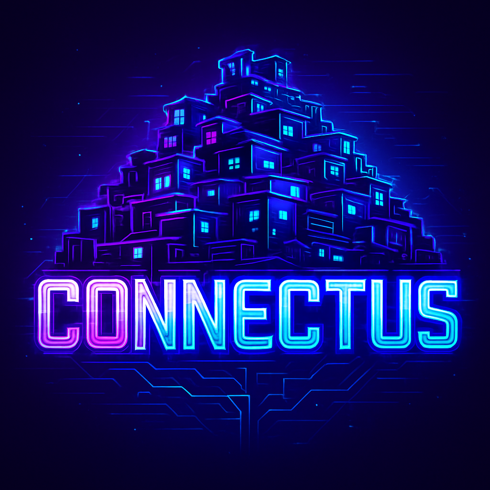

  

<h1 align="center">CONNECTUS 🚀</h1>

<strong>Plataforma gamificada de impacto social com tokens, missões, ranking e sorteio de NFTs simulados.</strong>

 

---

## 🌍 Sobre o projeto

**CONNECTUS** é uma plataforma gamificada que une **engajamento social**, **educação**, e o universo **Web3**, com foco em jovens de periferia.  
Criado durante o Hackathon **Meridian x Stellar**, o projeto tem como missão prevenir a **desistência escolar, profissional e emocional** entre jovens.

Através de um ambiente digital divertido e com propósito, os usuários acumulam XP e tokens por ações reais que geram impacto – como ir à escola, compartilhar conhecimento, reciclar lixo ou ajudar outras pessoas.

---

## 🎯 Por que criei esse projeto?

- Para combater o **vácuo existencial e social** que afasta jovens da educação e do trabalho.
- Para promover o uso **ético e consciente da Web3**, com foco em **missões com impacto**.
- Para oferecer uma alternativa leve, acessível e **gamificada** que **valoriza boas ações**.

---

## 🔥 Funcionalidades

✅ Página de **Perfil** com:
- XP e tokens acumulados
- Missões concluídas
- Sorteio de NFTs simulados

✅ Área de **Publicações** (timeline)
- Compartilhe ideias, reflexões e conquistas

✅ **Missões**
- Atividades sociais com pontuação real
- Sistema de validação e recompensa

✅ **Chat**
- Comunicação com outros jovens
- Espaço de apoio e trocas construtivas

✅ **Ranking**
- Classificação por XP/tokens
- Destaque para quem gera mais impacto

---

## 🎨 Design

- Interface **futurista** inspirada em jogos e painéis Web3
- 100% em **HTML e CSS puro** para facilitar visualização e acessibilidade
- Estética responsiva e adaptável a projetos futuros com backend (Flask, Firebase etc.)

---

## 🛠️ Tecnologias

- HTML5
- CSS3
- Design assistido com IA (Canva)
- [GitHub Pages](https://pages.github.com/) (recomendado para deploy)

---

## 💡 Próximos passos

- Integrar backend com Python + Firebase
- Implantar sistema real de XP, tokens e sorteios
- Criar dashboard administrativo para validação de missões
- Melhorar acessibilidade e gamificação responsiva

---

## ✨ Autor(a)

Feito com 💜 por [Roseane Carreiro](https://github.com/RoseaneC) — criadora do projeto **CONNECTUS**, sonhadora que acredita no poder da tecnologia com propósito.

---

## ⭐ Apoie e contribua

Se esse projeto tocou você, 🌱 dê uma estrela no repositório e compartilhe com alguém que acredita no impacto da juventude!

